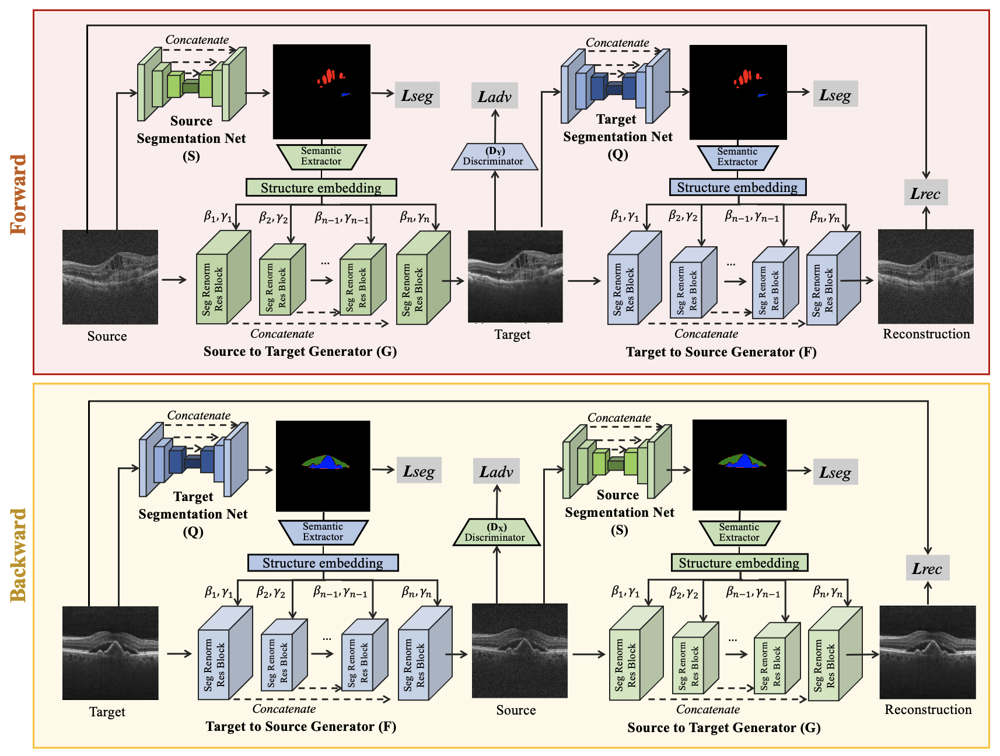

# Segmentation renormalized harmonization 

An anatomically-regularized un-paired image-to-image translation framework built on CycleGAN (https://github.com/junyanz/pytorch-CycleGAN-and-pix2pix).


## Environment
```shell script
conda create --name srn python=3.7
pip install -r requirements.txt
```

## Prepare the data
To speed up data loading for medical images which are typically 3D in Nifti/Nrrd/mhd format, h5 files are recommended for PyTorch dataloader. After train/test split, merge all 2D slices of subjects from each set to form a [N,w,h,1] array, where N is the number of total slices, (w,h) is the image size. Save arrays from source and target domains as a group 'src' (for source domain) and 'trg' (for target domain) in the h5 file. 

## Training
Use the script below to start training a translation model, where the naming convention of parameters follows the original CycleGAN implementation. 

"--joint_seg | --spade | --sem_dropout" are used to specify different models:
- If none of them is specified, [CycleGAN](https://arxiv.org/abs/1703.10593) is used;
- Specify --joint_seg to use [S-CycleGAN](https://openaccess.thecvf.com/content_cvpr_2018/papers/Zhang_Translating_and_Segmenting_CVPR_2018_paper.pdf)  (2D version) ;
- Specify --joint_seg and --sem_dropout to use [SemGAN](https://arxiv.org/abs/1807.04409);
- Specify --joint_seg and --spade to use proposed model. 
```shell script
python mains/train.py --name 'seg_renorm_cyclegan'\
      --model 'cycle_gan_2d'\
      --checkpoints_dir '../ckpts' \
      --crop_size 128 \
      --batch_size 4 \
      --lr_g 0.0002 \
      --lr_d 0.0001 \
      --gpu_id 0\
      --ngf 64 \
      --ndf 64 \
      --typeG 'resunet'\
      --netD 'n_layers'\
      --n_layers_D 2 \
      --dim 2\
      --save_epoch_freq 100\
      --save_latest_freq 2  \
      --input_nc 1\
      --output_nc 1\
      --dataset 'ixi'\
      --lambda_identity 0\
      --lambda_cc 0\
      --lambda_tv 0\
      --lambda_A 10\
      --lambda_B 10\
      --gan_mode 'lsgan'\
      --init_type 'normal'\
      --seg_nc 4\
      --niter 20\
      --niter_decay 300 \
      --joint_seg\
      --spade\
```
